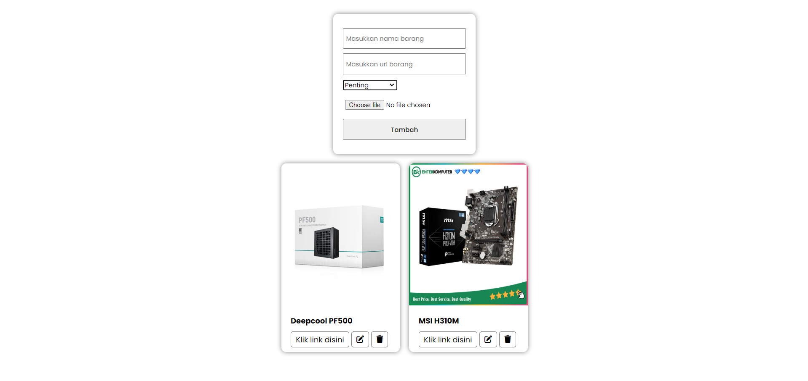
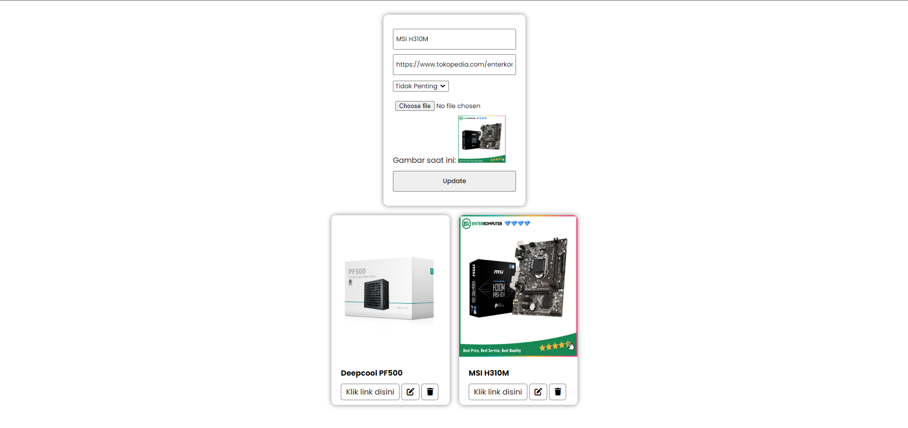

# APLIKASI WISHLIST PRODUK

Aplikasi ini merupakan aplikasi sederhana yang memungkinkan pengguna untuk menambahkan, mengedit, dan menghapus daftar produk impian. Aplikasi ini juga mendukung pengunggahan gambar produk.

## Fitur
- Menambahkan Produk: Pengguna dapat menambahkan produk baru dengan nama, URL, status, dan gambar.
- Edit Produk: Pengguna dapat mengedit data produk yang sudah ditambahkan.
- Hapus Produk: Pengguna dapat menghapus produk dari daftar wishlist.
- Daftar Produk: Menampilkan daftar produk yang ditambahkan, beserta statusnya (penting atau tidak penting).
- Upload Gambar Produk: Mendukung upload gambar produk dengan format JPG, PNG, JPEG, dan GIF.

## Teknologi Yang Digunakan
- HTML
- CSS
- PHP
- SQLite
- Font Awesome

## Penggunaan
1. Menambahkan Produk: Isi nama produk, URL, pilih status, dan unggah gambar.
1. Mengedit Produk: Pada daftar produk, klik ikon pensil pada produk yang ingin diubah.
1. Menghapus Produk: Klik ikon tempat sampah pada produk yang ingin dihapus.

> **JIKA ADA KESALAHAN, BUG, DAN FITUR BARU BERIKAN KOMENTAR KALIAN DI ``` ISSUES ``` TAB**

---



